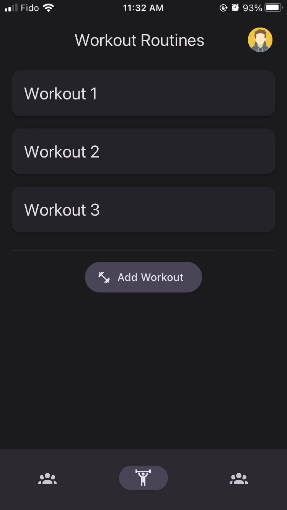
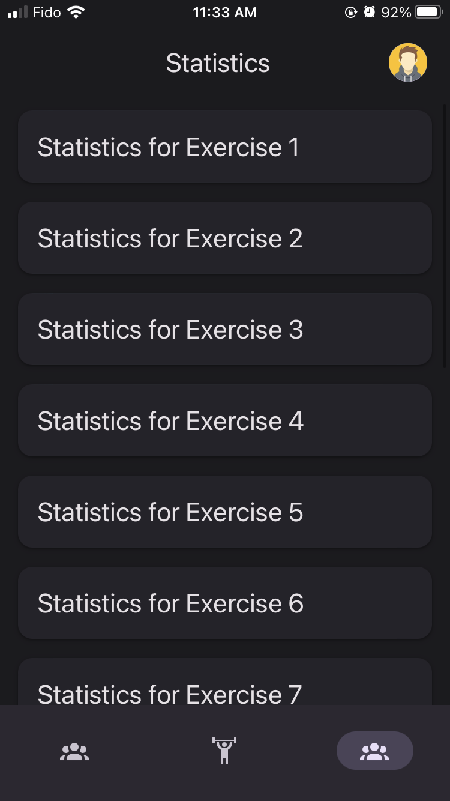
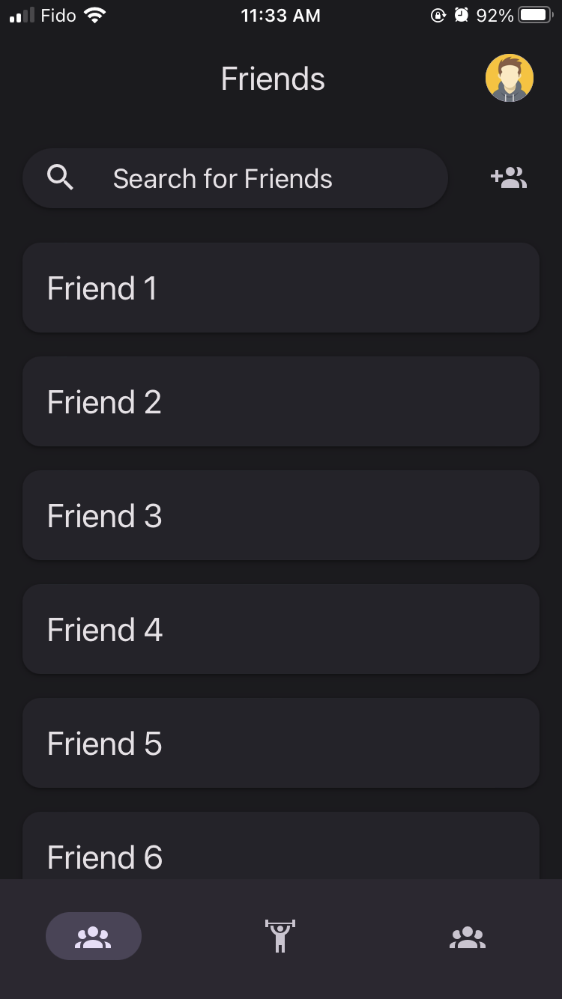

This hackathon project is a fitness tracking app that utilizes React Native for the frontend and a combination of Golang and MongoDB for the backend. The app allows users to track and log their fitness progress, including exercises, workouts, and other physical activity. Additionally, the app includes socializing features, such as the ability for users to connect with friends and share their progress, as well as participate in fitness challenges. The MongoDB database would be used to store user data, such as their fitness progress and social connections, while the Golang would be used to build the backend logic and handle communication between the frontend and the database.